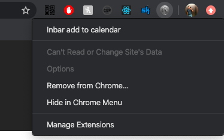

# ייצוא מאינבר ליומן
### שימוש
1. להתקין את התוסף לכרום [כאן](fff)
    1. ניתן להחביא את התוסף ע"י לחיצה על hide 
    
2. להיכנס למטריצה באינבר 
  
3. ???
4. להרוויח

## development 

### Installation
Run `yarn` in terminal

### cli
* `yarn build` - builds `dist` folder.
* `yarn build:watch` - builds `dist` folder and watching for changes.

### Pull requests
Are very welcome, make sure build passes and code is formatted.

