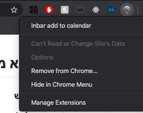
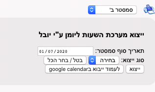
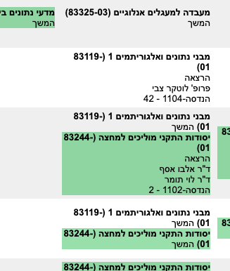
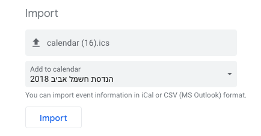
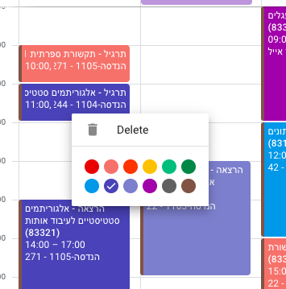

# ייצוא מאינבר ליומן
### שימוש
1. להתקין את [התוסף לכרום כאן](https://chrome.google.com/webstore/detail/inbar-add-to-calendar/gmgopagabnnniohnbaaehjghlleaembc/related?authuser=4&hl=en).
    * ניתן להחביא את התוסף ע"י לחיצה על hide, אין בו שימוש מהתפריט הזה.  
      
2. להיכנס למטריצה באינבר.  
    
3. תבחרו את הסמסטר המתאים והאם רוצים ייצוא מלא או רק חלק מהקורסים.  

    * עבור `סוג ייצוא: בחירה`, הקורסים שיוצאו יהיו בצבע ירוק, ניתן לסמן קורסים ע"י לחיצה או בעזרת שימוש כפתור `בטל \ בחר הכל`.  

        
4. ללחוץ על כפתור `ייצוא`.
5. לייבא ליומן את קובץ ה`ics` שירד.
    * במידה ואתם משתמשים בgoogle calendar (כנראה), אז על מנת לייבא יש לעשות את הצעדים הבאים:
        1. ללחוץ על כפתור `לעמוד הייבוא בgoogle calendar`.
        2. בעמוד שנפתח לבחור את הקובץ שירד ואת היומן המתאים שאתם רוצים לייבא אליו.  
        
        3. ללחוץ על import.
            * כעת סיימתם, תחזרו ליומן ותראו את כל הקורסים שלכם ביומן, טיפ, לחיצה ימינית על האירוע פותחת רשימת צבעים לשינוי זריז.  
            
6. ???
7. להרוויח!

### [לרישום תקלות](https://github.com/unimonkiez/inbar-add-matrix-to-calendar/issues)

## development 

### Installation
Run `yarn` in terminal

### cli
* `yarn build` - builds `dist` folder.
* `yarn build:watch` - builds `dist` folder and watching for changes.

### Pull requests
Are very welcome, make sure the build passes and the code is formatted.

